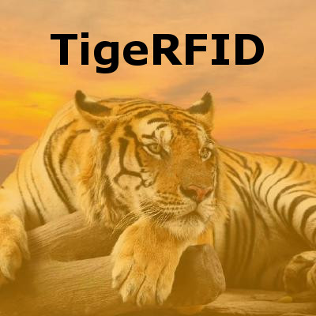

# TigeRFID

## Introduction

This repository has been created in honor of my father, Touraj Ghaffari. He founded [ActiveWave, Inc.](http://www.activewaveinc.com/) in 2001. It was his life work and something he loved and enjoyed thoroughly. He also loved spreading knowledge. In honor of that principle, we, his three sons, have open-sourced everything associated with his active RFID system under the [Apache 2.0 license](license). We hope this release helps you acheive your dreams.

_Note: Any help in cleaning up the files or directory structure is very much appreciated. We included everything we found in case any of it is useful to someone. Any and all advice is appreciated!_

## Table of Contents

1. [API](api) - Included are APIs for C++ .NET, C# .NET, C# .NET CE, and VB .NET. There is a manual for a Java-based API which we haven't yet found. There is also documentation - both for internal use and customers.

2. [BOM Files](bom-files) - These are all the Bill Of Materials we could find. This should provide the different parts as well as costs associated with each based on the time they were made.

3. [Documentation](documentation) - These are documents, converted to Markdown, that were important enough for inclusion, but without a natural location that we could determine.

4. [Presentations](presentations) - These are the marketing materials that were sent to potential customers for a few different types of applications.

5. [Protel Files](protel-files) - These are all the schematics and other related files that are required to actually manufacture the hardware.

6. [sealTag](sealtag) - One of the most versatile and popular tags of all, this was important enough to reside in its own section.

7. [Software](software) - This includes all the different applications required to actually run the system.

## Fun Touraj Fact

Touraj's favorite animal was the tiger - in particular, the [Caspian tiger](https://en.wikipedia.org/wiki/Caspian_tiger). Just like this project has arisen from extinction, the Caspian tiger should hopefully [make a triumphant return](http://www.bbc.co.uk/newsbeat/article/38663101/scientists-want-to-bring-cousin-of-extinct-caspian-tiger-to-central-asia) as well!

## Thank You

* Ali Amjadi

* Mehdi Haidari

* [Fabiano Kovalski](https://www.linkedin.com/in/fabianogk)

* [Vincent Mamo](https://www.linkedin.com/in/vincent-spinella-mamo-5262524)

* Reza Mokhtarzadeh
